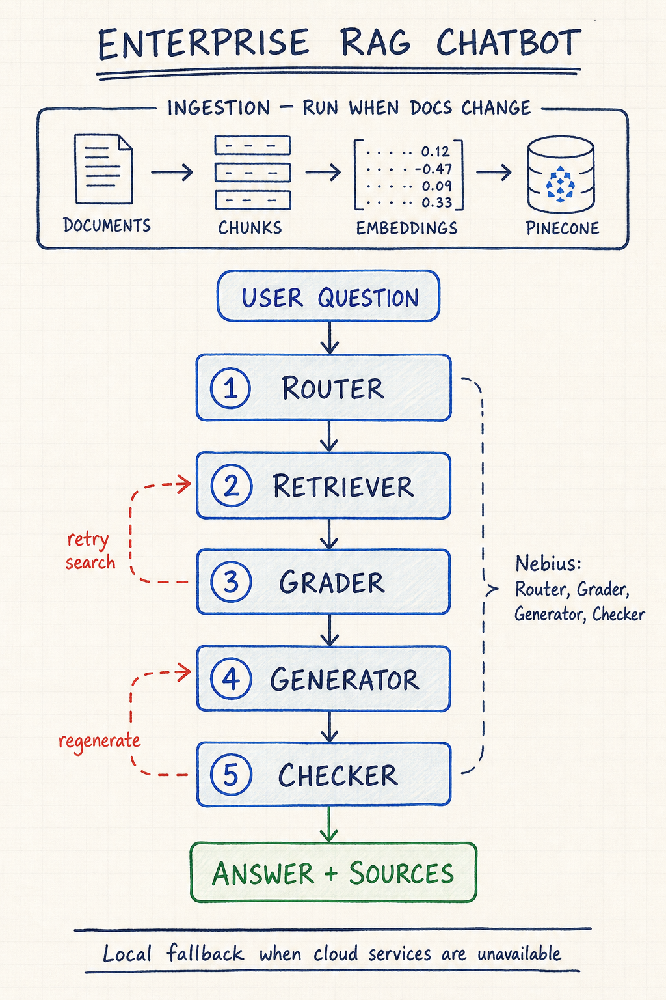

# Enterprise RAG Chatbot — Project Documentation

**Repository:** `vjalagam/Week2_HR_app`
**Application:** ABC Enterprise RAG Chatbot
**Interface:** Streamlit web chat and Python CLI
**Knowledge domains:** Human Resources, Technical Documentation, and Compliance/Security
**Operating model:** Local-first learning project with optional DeepSeek and Pinecone integrations

## 1. Overview

The Enterprise RAG Chatbot answers natural-language questions using approved ABC enterprise documents. Users do not select a category. The application automatically routes each question to HR, technical, compliance, or a multi-domain search. Short follow-up questions are contextualized with the recent conversation before routing and retrieval.

The five-stage LangGraph workflow is:

1. **Router** — automatically classifies the question.
2. **Retriever** — searches the automatically selected document namespace.
3. **Grader** — removes irrelevant chunks.
4. **Generator** — produces an answer from the retained context.
5. **Checker** — accepts the answer only when all claims are supported by the combined source context.

When cloud credentials are unavailable, keyword routing, lexical retrieval, extractive answers, and overlap checks keep the application functional offline.

## 2. User experience

### Web application

Start the application:

```bash
source .venv/bin/activate
streamlit run ui.py
```

Then open `http://localhost:8501`.

Users can:

- Ask questions in their own words without choosing a document category.
- Ask natural follow-ups such as “What about part-time employees?”
- Inspect the selected namespace, grounding result, retry count, correlation ID, sources, and excerpts.
- Mark responses helpful or unhelpful.
- Start a new conversation.

The UI currently opens directly with a local demo identity. Authentication is intentionally deferred for this learning use case.

### CLI

```bash
python main.py --question "How many days of annual leave do employees receive?"
```

## 3. Architecture



The sketch separates document ingestion from the live question flow. Every user question passes through the five query nodes before the UI displays a verified answer and its sources.

### Graph state

| Field | Purpose |
|---|---|
| `question` | Current user question |
| `retrieval_query` | Contextualized query used for automatic routing and retrieval |
| `conversation_history` | Recent user and assistant turns |
| `doc_type` | Automatically selected domain |
| `documents` | Retrieved and relevance-filtered chunks |
| `grading_result` | Relevance or access-control outcome |
| `generation` | Generated answer or refusal |
| `hallucination_result` | `grounded` or `not_grounded` |
| `retry_count` | Current retry/check counter |
| `correlation_id` | Request identifier included in logs and UI metadata |

## 4. Processing behavior

### Automatic routing and follow-ups

The router returns `hr`, `technical`, `compliance`, or `general`. DeepSeek performs classification when configured; otherwise keyword routing is used. For short or referential follow-ups, the most recent user question is included in the internal retrieval query. Users never need to know the namespace structure.

### Retrieval and access control

Specific-domain questions retrieve up to four chunks from the selected namespace. General questions search all three document namespaces and retrieve up to two chunks from each.

Pinecone documents are indexed into matching `hr`, `technical`, and `compliance` namespaces. If an older index used the former `enterprise` namespace, run the indexing command once to populate the corrected namespaces:

```bash
python main.py --index
```

Local fallback retrieval performs namespace-filtered lexical scoring over the bundled document chunks.

### Relevance grading

Each chunk is graded independently. The model must respond with `{"score":"yes"}` or `{"score":"no"}`. Without the LLM, keyword overlap determines relevance.

### Generation

The generator receives only retrieved context plus limited recent conversation history. Its prompt prohibits unsupported information and out-of-domain answers. Without DeepSeek, the application returns an extractive portion of the source context.

### Strict hallucination checking

All retained source chunks are combined for the checker, up to a 6,000-character limit. The checker must return:

```json
{"score": "yes"}
```

only when the answer contains exclusively information supported by the provided sources. Unsupported facts, numbers, or claims produce `{"score":"no"}`. Failed checks trigger regeneration within the retry limit, followed by a refusal if grounding cannot be established.

## 5. Security and operations

Implemented controls include:

- Question normalization and configurable maximum length.
- Per-identity request limiting.
- JSON logs with correlation IDs, status, and operation duration.
- User-safe UI errors that avoid exposing internal exceptions.
- Provider secret values loaded from environment variables or mounted `*_FILE` paths.
- SQLite persistence for messages and feedback.
- `.env` and local databases excluded through `.gitignore`.

Authentication and user authorization are not included in the current local learning version. Do not expose the application publicly without adding an appropriate identity layer.

## 6. Persistence and feedback

`ChatStore` initializes an SQLite database at `RAG_DATABASE_PATH` (default `data/rag.db`). It stores:

- User and assistant messages
- Session and user identifiers
- Response metadata
- Timestamps
- Helpful/unhelpful feedback

SQLite is appropriate for this single-machine learning project. No Docker, Kubernetes, Terraform, or other deployment layer is included.

## 7. Configuration

| Variable | Default | Purpose |
|---|---|---|
| `DEEPSEEK_API_KEY` | Empty | Enables DeepSeek LLM operations |
| `DEEPSEEK_API_KEY_FILE` | Empty | Reads the DeepSeek key from a mounted file |
| `DEEPSEEK_BASE_URL` | `https://api.deepseek.com` | OpenAI-compatible endpoint |
| `DEEPSEEK_MODEL` | `deepseek-chat` | Chat model |
| `PINECONE_API_KEY` | Empty | Enables Pinecone retrieval |
| `PINECONE_API_KEY_FILE` | Empty | Reads the Pinecone key from a mounted file |
| `PINECONE_ENVIRONMENT` | Empty | Pinecone serverless region |
| `PINECONE_INDEX_NAME` | `abc-enterprise-rag` | Vector index |
| `EMBEDDING_MODEL` | `sentence-transformers/all-MiniLM-L6-v2` | Embedding model |
| `RAG_DATABASE_PATH` | `data/rag.db` | SQLite database |
| `RATE_LIMIT_PER_MINUTE` | `30` | Requests allowed per identity |
| `MAX_QUESTION_LENGTH` | `2000` | Input-length limit |
| `LOG_LEVEL` | `INFO` | Application logging level |

## 8. Repository structure

| Path | Responsibility |
|---|---|
| `ui.py` | Streamlit chat, optional login, metadata, sources, and feedback |
| `main.py` | Root CLI entry point |
| `enterprise_rag/app.py` | Validated request execution and CLI handling |
| `enterprise_rag/config.py` | Environment and secret-file configuration |
| `enterprise_rag/security.py` | Input validation and local rate limiting |
| `enterprise_rag/observability.py` | JSON logs, correlation IDs, and timings |
| `enterprise_rag/storage.py` | SQLite chat and feedback persistence |
| `enterprise_rag/data_ingestion.py` | TXT loading, namespace inference, and chunking |
| `enterprise_rag/vector_store.py` | Pinecone namespaces and local fallback retrieval |
| `enterprise_rag/graph.py` | Five-stage RAG workflow and conversational routing |
| `enterprise_rag/evaluation.py` | Route accuracy, grounded rate, and token-F1 evaluation |
| `evaluation/dataset.json` | Labeled evaluation examples |
| `Docs/` | ABC enterprise source documents |
| `tests/test_rag.py` | Offline pipeline, security, persistence, metric, and follow-up tests |

## 9. Testing and evaluation

Run automated tests without using cloud providers:

```bash
DEEPSEEK_API_KEY='' PINECONE_API_KEY='' pytest -q
```

The current suite covers:

- Namespace routing
- Offline grounded answers
- Input validation
- Durable history and feedback
- Evaluation metrics
- Contextual routing of natural follow-ups

Run the labeled evaluation:

```bash
DEEPSEEK_API_KEY='' PINECONE_API_KEY='' \
python -m enterprise_rag.evaluation evaluation/dataset.json
```

It reports route accuracy, grounded-answer rate, and mean token F1.

## 10. Local setup

```bash
python3 -m venv .venv
source .venv/bin/activate
pip install -r requirements.txt
cp .env.example .env
streamlit run ui.py
```

Pinecone and DeepSeek are optional. Leave their keys empty for offline fallback mode. If Pinecone is enabled, index the source documents before relying on hosted retrieval.

## 11. Current limitations

- Source ingestion supports top-level UTF-8 `.txt` files only.
- Local retrieval is lexical rather than embedding-based.
- Offline answers are extractive rather than synthesized.
- SQLite is designed for one-machine use.
- Rate limiting is process-local and resets when the app restarts.
- Source excerpts do not yet provide section-level or claim-level citations.
- The application has no authentication or per-user document authorization.
- Retry counting is shared across grading and checking.
- Document chunks are loaded and created for each request rather than cached.

## 12. Recommended next steps

Keep additions proportional to the learning use case:

1. Expand the labeled evaluation dataset with expected source passages.
2. Add tests for access denial, retries, refusals, and malformed model JSON.
3. Cache unchanged document chunks to reduce repeated work.
4. Add explicit document metadata instead of relying only on filenames.
5. Improve offline sentence selection and source citation precision.

Deployment packaging should be introduced only if the application later needs to run outside the local development environment.

---

This document reflects the current repository after the production-gap fixes, strict hallucination-check update, zero-friction conversational routing, optional local authentication, and removal of Docker-related deployment artifacts.
